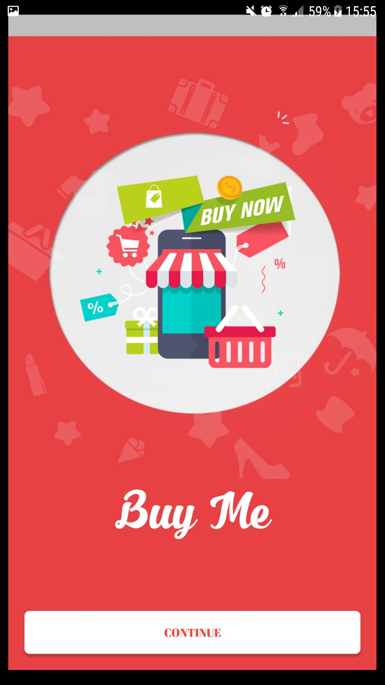
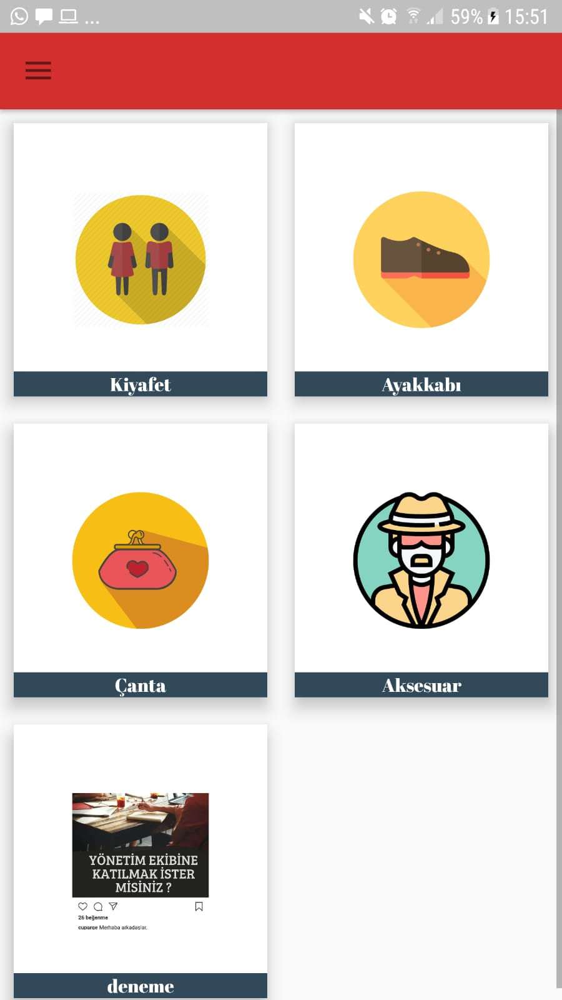
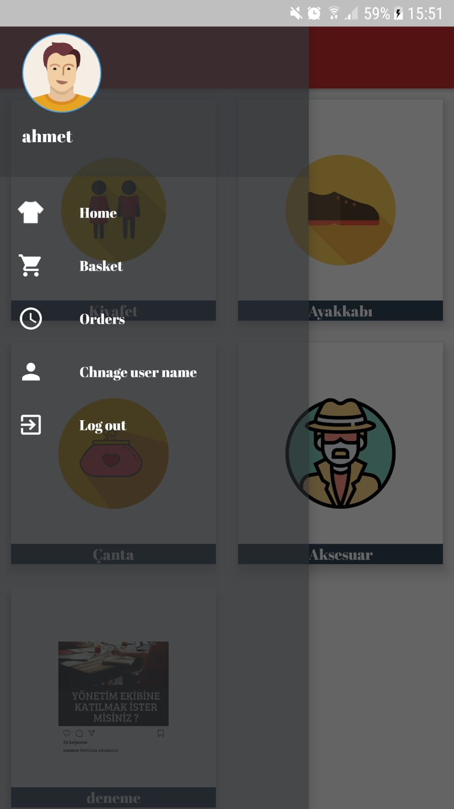
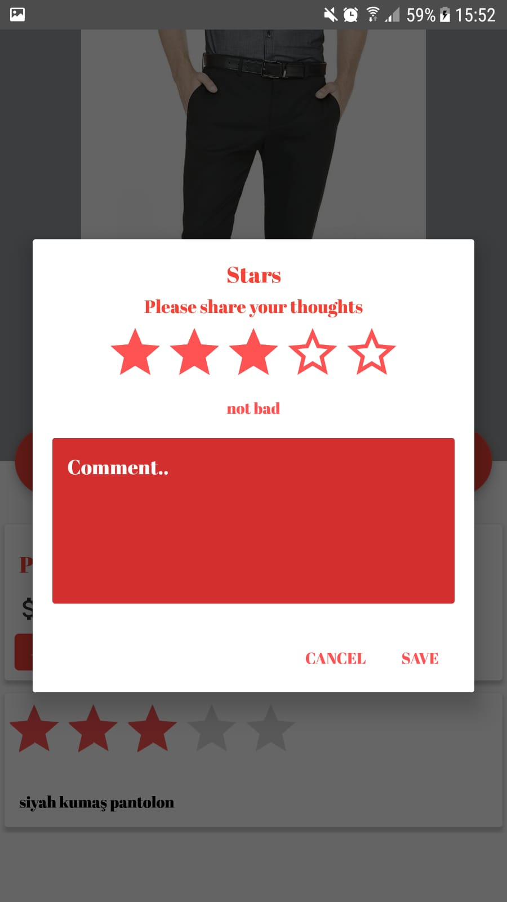

# BuyMe
Android Shopping app

This application contains two android apps, this project that is made for the clients, 
the other projcet is server side (made for admins).

the server side repository:
https://github.com/cenahmedar/BuyMeServer

this app works with:
1. User accounts and Facebook library.
2. sqlite.
3. Firebase.
4. google maps.

** the admins will be able to create categories, create
products, track the order and change the status of order. 

** the users can list all the products, buy any product,
add products to basket, track orders.

this app also use notifications for each the admins and the users to notify them about the order status.

